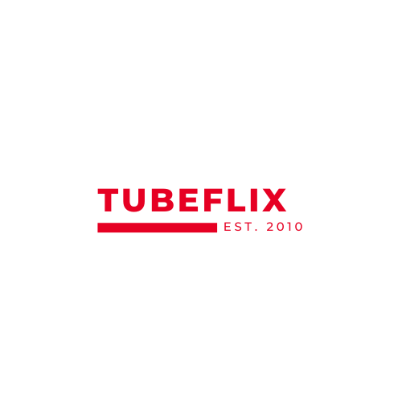

<br/>
<div align="center">
<a href="https://github.com/manassehgitau/TubeFlix">

</a>
<h3 align="center">TubeFlix</h3>
<p align="center">
A website that recommends the best movies and tv shows to watch
<br/>
<br/>
<a href="https://github.com/manassehgitau/TubeFlix/blob/main/README.md"><strong>Explore the docs »</strong></a>
 <br />
 <br />
<a href="https://github.com/manassehgitau/TubeFlix/blob/main/README.md](https://www.canva.com/design/DAF_ycM3wBI/eg9OvrqC8Zj7PkHeUQ16rg/view?utm_content=DAF_ycM3wBI&utm_campaign=designshare&utm_medium=link2&utm_source=uniquelinks&utlId=h9f1517011b)"><strong>See the Presentation »</strong></a>
<br/>
<br/>
<a href="https://manassehgitau.github.io/TubeFlix/">View Demo .</a>  
<a href="https://github.com/manassehgitau/TubeFlix/issues">Report Bug .</a>
<a href="https://github.com/manassehgitau/TubeFlix/issues">Request Feature</a>
</p>
</div>

## About The Project

 <!-- > An Image of the screenshot is added -->

<!--  -->

TubeFlix is a tech business specialising in smartwatches. These wearables are designed to track individual health metrics in real-time while automatically logging data to TubeFlix's secure infrastructure. Once collected, this essential information is processed and transferred directly to the healthcare facility where the individual is registered, allowing medical specialists to give timely interventions as needed.

### Features of the Smartwatch:

---

1. Health Sensors: The smartwatch tracks critical health indicators such as heart rate, blood pressure, and oxygen levels, providing valuable insights into its users' well-being. It is equipped with various health sensors.
2. IoT Connectivity: The smartwatch effortlessly connects with other devices, leveraging the Internet of Things (IoT) and enabling a comprehensive health monitoring ecosystem that enhances user experience and data accuracy.
3. AI Integration: Utilizing artificial intelligence, the smartwatch analyzes the collected data to offer personalized health tips and alerts, helping users maintain optimal health and stay informed about potential health concerns.
4. Assisted Living Features: Designed with the needs of seniors in mind, the device includes features that assist with daily living activities, such as medication reminders and emergency alerts, promoting independence and peace of mind.

### Sections of the website:

---

- Landing Page: A visually appealing and informative landing page that introduces visitors to Bit Health and its revolutionary smartwatch.
- Device Features: A dedicated section highlighting the unparalleled capabilities of the smartwatch, showcasing how it stands out in the market.
- About the Company: An engaging narrative about Bit Health, its mission, vision, and commitment to advancing health technology.
- Services Offered: A clear overview of the services provided by Bit Health, emphasizing the value added to both users and healthcare providers.
- The Team: A section introducing the talented individuals behind the startup, showcasing their expertise and dedication to health tech innovation.
- Footer: Quick links and contact information for easy navigation and access to customer support.
- (Optional) Blog Section: A curated blog that offers insights on health tech trends, tips for using the smartwatch effectively, and updates from Bit Health, fostering community engagement and keeping users informed.

### Built With

The TubeFlix website has been built with the following technologies

- [HTML and CSS]()
- [Tailwind CSS]()
- [Git]()
- [Vs Code]()

## Getting Started

To contribute to this project the following steps must be followed.

### Prerequisites

The following are required before working on the project:

- Basic knowledge of HTML, CSS, Tailwind CSS and Javascript
- A preferred code editor or IDE installed on your PC
- An understanding of how git works

### Installation

_To install the project locally on your machine, follow the steps below. _

1. Follow the project on [github](https://github.com/manassehgitau/TubeFlix)
2. Clone the repo
   ```sh
   git clone https://github.com/manassehgitau/TubeFlix.git
   ```
3. Alternatively you can download the project using this [link](https://github.com/manassehgitau/TubeFlix)
4. follow the steps below to get into the project
   ```bash
   cd TubeFlix
   code .
   ```

## Usage

To run the project locally use the following steps

- start a live server of the project locally on your machine
- run the localhost of the project on your preferred project to render the HTML file

## Development Roadmap

- [x] Navigation Bar
- [x] Hero Section
- [x] Services and About section
- [x] Prices and team section
- [x] footer section
- [ ] Additional Features
  - [ ] Blog Section
  - [ ] Redirect to active blog posts

See the [open issues](https://github.com/manassehgitau/TubeFlix/issues) for a full list of proposed features (and known issues).

## Contributing

Contributions are what make the open-source community such an amazing place to learn, inspire, and create. Any contributions you make are **greatly appreciated**.

If you have a suggestion that would make this better, please fork the repo and create a pull request. You can also simply open an issue with the tag "enhancement".
Don't forget to give the project a star! Thanks again!

1. Fork the Project
2. Create your Feature Branch (`git checkout -b feature/AmazingFeature`)
3. Commit your Changes (`git commit -m 'Add some AmazingFeature'`)
4. Push to the Branch (`git push origin feature/AmazingFeature`)
5. Open a Pull Request

## License

Distributed under the MIT License. See [MIT License](https://opensource.org/licenses/MIT) for more information.

## Contact

Your Name - [@GitauManasseh](https://twitter.com/GitauManasseh) - gitaumanaasseh1@gmail.com

Project Link: [TubeFlix Website Project Link](https://github.com/manassehgitau/TubeFlix)

## Acknowledgments

A big shout-out to my technical mentor
[Ezekiel Kibiego](https://github.com/ezekielkibiego)
